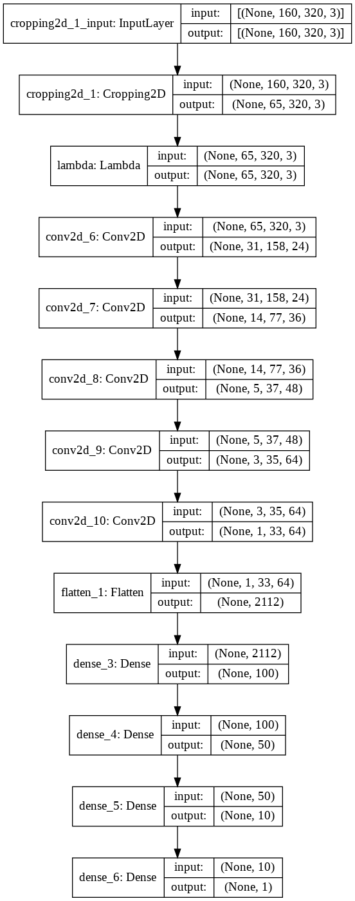
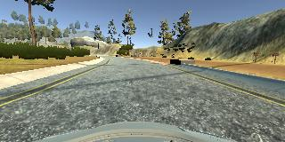
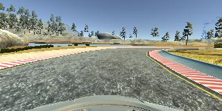
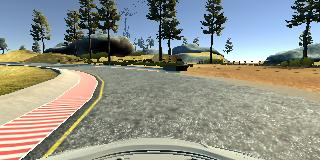
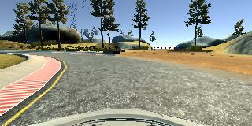
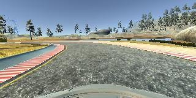

# **Behavioral Cloning Project** 

The goals / steps of this project are the following:

* Use the simulator to collect data of good driving behavior
* Build, a convolution neural network in Keras that predicts steering angles from images
* Train and validate the model with a training and validation set
* Test that the model successfully drives around track one without leaving the road
* Summarize the results with a written report


---
### Files Submitted & Code Quality


My project includes the following files:

* model.py containing the script to create and train the model
* drive.py for driving the car in autonomous mode
* model.h5 containing a trained convolution neural network 
* MyWriteup\_P4.md/MyWriteup\_P4.pdf summarizing the results
* run1.mp4 with a full lap of autonomous driving 

Using the Udacity provided simulator and my drive.py file, the car can be driven autonomously around the track by executing 
```sh
python drive.py model.h5
```

The model.py file contains the code for training and saving the convolution neural network. The file shows the pipeline I used for training and validating the model, and it contains comments to explain how the code works.

### Model Architecture and Training Strategy


My model consists of a convolution neural network suggested in Section 4 of the [End to End Learning for Self-Driving Cars](https://arxiv.org/abs/1604.07316) paper by NVIDIA research team. Below is the model architecture as produced by Kera's *plot\_model()* function: 




with 348,219 trainable parameters.


Apart from the NVIDIA's conv net layers, there are two preprocessing layers. First, using a *Cropping2D()* layer, the input images were cropped. This helped reducing both computational complexity (the number of parameters increases from 348,219 to 2,882,619 when not cropping the images) and the amount of noise (irrelevant signals). Then the data/images were normalized by using a Keras lambda layer: *model.add(Lambda(lambda x: x/255.0 - 0.5))*.
 
Other CNN network architectures (VGG-like) were tried as well, but NVIDIA configuration seems optimal. 


#### Training

To capture good driving behavior, I first included the Udacity's own data from the *'data/'*  folder. I also included extra videos of my own driving in folder *'data\_smooth_curves/'* (mainly using center lane driving; both directions). 
Here is an example image of center lane driving:



I also recorded videos of a vehicle recovering from either side of the road (folder *'data_extra/'*), as well as videos of driving around cornes/curves (folder *'data\_curves/'*). Finally, I recorded examples of driving to target specific parts of the track where the car failed to drive correctly/smoothly (folder *'data_errors/'*).
 
Examples:






 
Only the first track was used for data colleciton. 

The data was then concatenated to a training set comprised of 13,195 training examples. 
The training set was then augmented by flipping images/label with the help of OpenCV function *cv2.flip()*, as suggested in one of Udacity's lectures, to help dealing with the left turn bias. This resulted in doubling a training set to **26,390** examples. 

Here is an example of an original and a horizontally flipped image:




To assess model's ability to generalize, the data (image and steering angle) was split into a training and validation set (80%-20% split was used). The model then used an Adam optimizer (without a learning rate schedule) with Kera's default configuration. The training converged after the 1st epoch (*batch\_size* = 128) so only 1 epoch was used for training. 


The resulting model was then used in the Autonomous mode and the vehicle was able to drive a full lap without leaving the road. 
